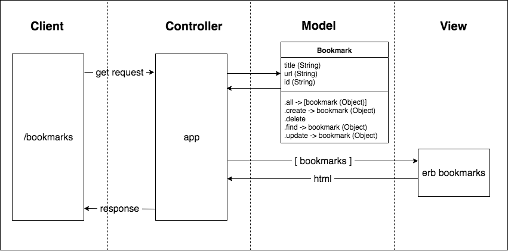

# Bookmark Manager

### User Stories

As a user,
So that I can view what pages I visit a lot,
I want be able to see a list of bookmarks.

As a user
So I can store bookmark data for later retrieval
I want to add a bookmark to Bookmark Manager.

As a user
So I can remove my bookmark from Bookmark Manager
I want to delete a bookmark.

### Domain Model



### To set up the database

Connect to `psql` and create the `bookmark_manager` and `bookmark_manager_test` databases:

```
CREATE DATABASE bookmark_manager;
CREATE DATABASE bookmark_manager_test;
```

To set up the appropriate tables, connect to each database in `psql` and run the SQL scripts in the `db/migrations` folder in the given order.
